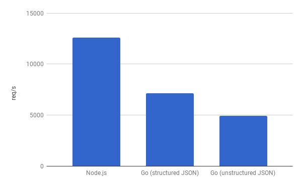

# REST Server Performance

Compare simple REST server performance in Node.js and Go.

Both servers do the same - parse the JSON body and return it back in the response.
No external libraries are used, just the builtin APIs.

Install
- Node.js
- Go
- [wrk](https://github.com/wg/wrk)

The POST request is defined in [post.lua](post.lua).
The content is ~4KB JSON.

```
$ node -v
v10.1.0
$ go version
go version go1.10.1 linux/amd64
$ cat /etc/issue
Ubuntu 16.04.4 LTS \n \l
```
CPU: Intel® Core™ i7-7500U CPU @ 2.70GHz × 4

## Node.js
Start the server
```
$ node server.js
Listening on port 3000
```
Run the test in a separate console
```
$ wrk -d 20s -s post.lua http://localhost:3000
Running 20s test @ http://localhost:3000
  2 threads and 10 connections
  Thread Stats   Avg      Stdev     Max   +/- Stdev
    Latency   793.29us  221.36us  11.96ms   92.88%
    Req/Sec     6.36k   513.96    12.33k    83.04%
  253629 requests in 20.10s, 564.55MB read
Requests/sec:  12618.86
Transfer/sec:     28.09MB
```
During the test the _node_ process runs at ~100% CPU and ~70MB memory.

## Go
Start the server
```
$ GOMAXPROCS=1 go run server.go
2018/05/19 23:45:39 Listening on port 3000
```
To get comparable results we start the go server with `GOMAXPROCS=1` as Node.js executes JavaScript in a single thread. To utilize multiple CPU cores with Node.js you could use the _cluster_ module. Anyway, in the cloud your process usually gets one core or even less.

Run the test in a separate console
```
$ wrk -d 20s -s post.lua http://localhost:3000
Running 20s test @ http://localhost:3000
  2 threads and 10 connections
  Thread Stats   Avg      Stdev     Max   +/- Stdev
    Latency     1.40ms  735.96us   7.03ms   59.42%
    Req/Sec     3.59k   249.95     7.36k    93.77%
  143198 requests in 20.10s, 318.06MB read
Requests/sec:   7124.41
Transfer/sec:     15.82MB
```
During the test the _server_ process runs at ~100% CPU and ~10MB memory.

The Go server parses the JSON request into fixed structures.
It is interesting to test what happens when we use unstructured JSON parsing with `interface{}`. So, open [server.go](server.go) and change this line
```
	var body Body
```
to
```
	var body interface{}
```
Run again the test
```
$ wrk -d 20s -s post.lua http://localhost:3000
Running 20s test @ http://localhost:3000
  2 threads and 10 connections
  Thread Stats   Avg      Stdev     Max   +/- Stdev
    Latency     2.03ms    1.08ms  22.77ms   63.43%
    Req/Sec     2.48k   128.59     2.73k    74.00%
  98894 requests in 20.01s, 219.65MB read
Requests/sec:   4943.11
Transfer/sec:     10.98MB
```

## Conclusion
Surprisingly Node.js is faster at HTTP and JSON handling.



We see also that in Go structured JSON is faster.
You can find more details about this [here](https://github.com/dotchev/go-json-bench).
